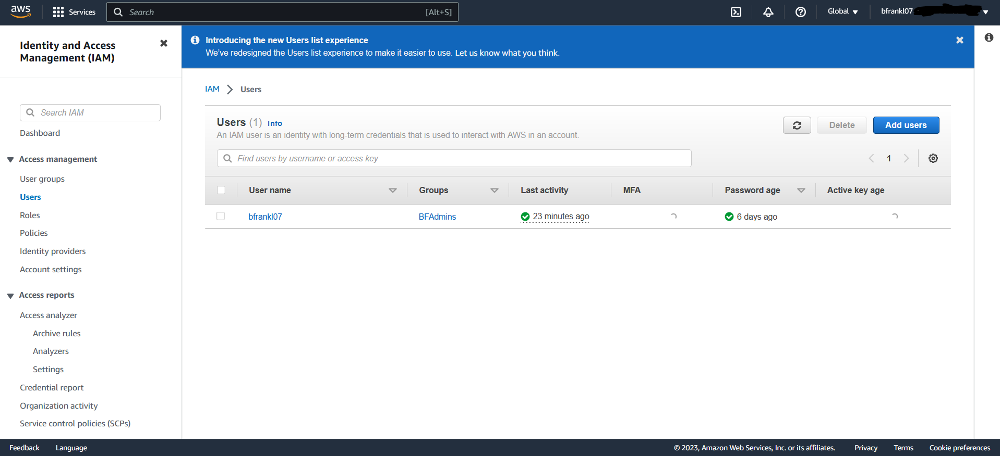
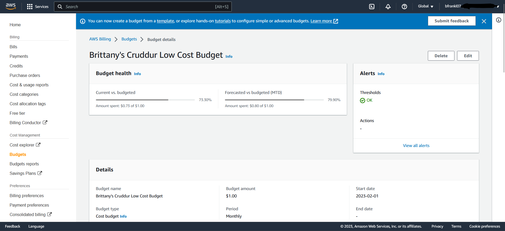
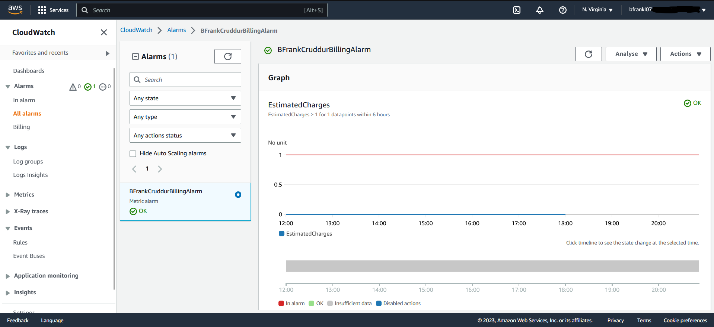
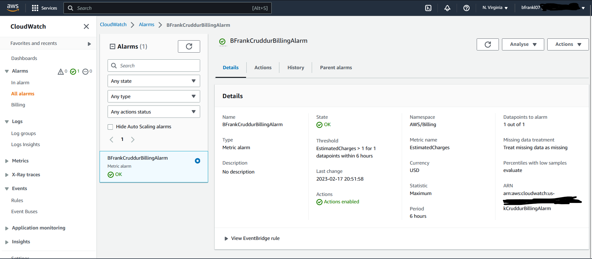
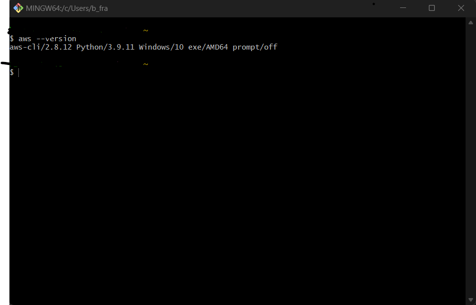

# Week 0 — Billing and Architecture

For this week's homework, I made some updates to my existing AWS account. Usually I always used my root account whenever I played around with AWS, but I finally created an Admin account to be used instead of always using the root. When creating the Admin role, I created an Adminstrator user group and then added the new role to that user group. I gave the user group the following permissions:
Billing (AWS created and managed permission)
AdministratorFullAccess (AWS created and managed permission)
BillingFullAccess (I created this permission although it's probably redundant)

Admin User:

In addition to creating an Admin account, I also set up a budget and a billing alarm as well as a service health alert through EventBridge. The budget and the billing alarm are both set to make sure the AWS charge does not go over $1. The billing alarm will send out an email via SNS topic when the amount is $0.85 or higher. I've never used EventBridge so that was interesting to be able to play around with that service. I was able to set up an SNS topic which sends an email when any AWS service has a health event.

AWS Budget:

AWS Billing Alarm:

Since I've used AWS some in the past, the AWS CLI was already set up on my machine.
AWS CLI:

Cruddur Logical Diagram:
https://lucid.app/lucidchart/b8bf7956-62b5-4228-957d-270e5f291795/edit?viewport_loc=-239%2C-698%2C678%2C752%2C0_0&invitationId=inv_097ac65e-c2d9-420d-9909-a61f5f321894

Cruddur Conceptual Diagram:
https://lucid.app/lucidchart/3d9231d9-004c-430e-ba64-0dc6301365cf/edit?viewport_loc=220%2C331%2C1707%2C753%2C0_0&invitationId=inv_e163e196-222a-43c9-942e-a4d8137030a8

