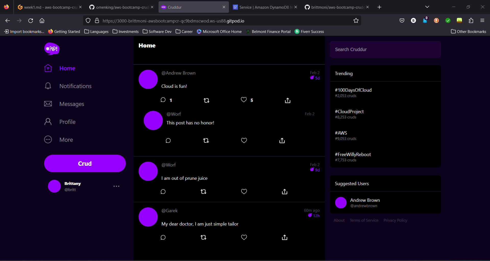

# Week 1 — App Containerization

For this week's homework I created the Docker containers for the backend and the frontend for the Cruddur application. In order to containerize both the backend and frontend, I had to create a Dockerfile within the backend-flask directory and frontend-react-js directory. Within these Dockerfiles, I had to configure the endpoints and specify the ports being used for the Cruddur application's backend and frontend. After the Dockerfiles were created, I created docker-compose.yml file in order to compose the containers and verify that they were being run as expected. I was able to verify that both the frontend and the backend endpoints were being reached successfully.

I also configured the Notifications endpoints for the Cruddur application. Now when the user navigates to Notifications in the application, the Notifications page is displaying properly. From the UI, I built the  NotificationsFeedPage.js in the frontend-react-js/src/pages directory. I also added the NotificationsFeedPage.css stylesheet so that the Notifications page styling remained consistent with the styling of the application. After creating NotificationsFeedPage.js and NotificationsFeedPage.css, I also had to update App.js so that on click of Notifications on the UI, the appropriate page will be loaded.

On the backend, for the Notifications page, I had to build notfications_activities.py and update app.py so that the correct backend endpoint will be reached when the user selects Notifications on the UI.

The last thing that I did was update the docker-compose.yml file to include a DynamoDB Local container and a Postgres container. At the moment, no data is being stored in these containers but I was able to verify that they are being loaded when executing the 'Compose Up' command.