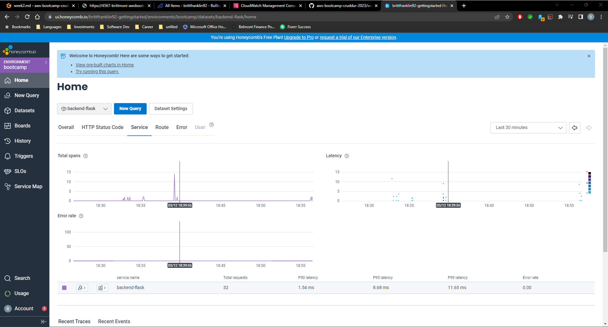
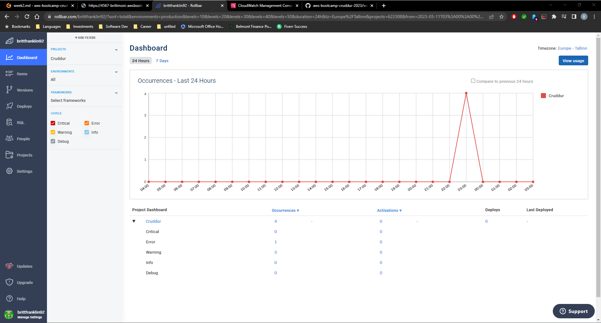
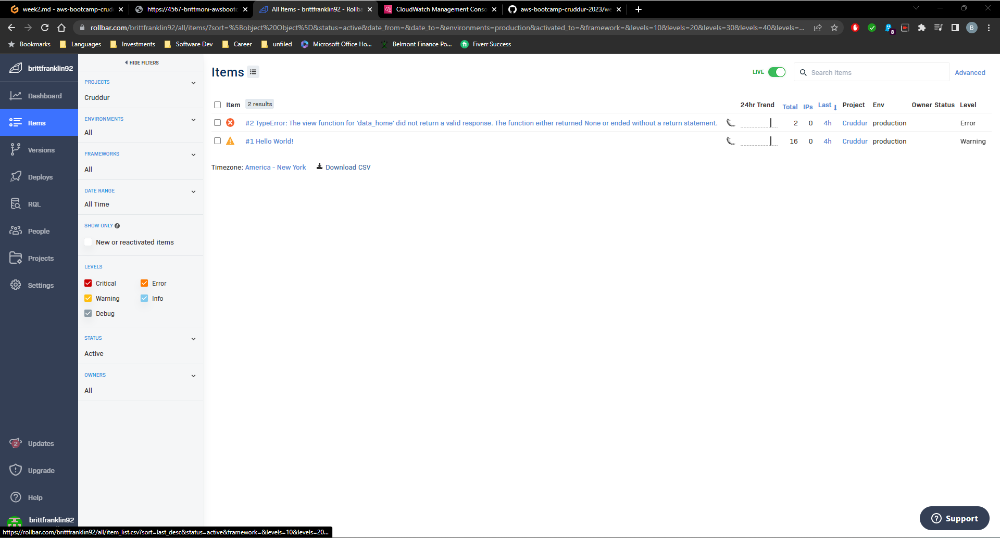
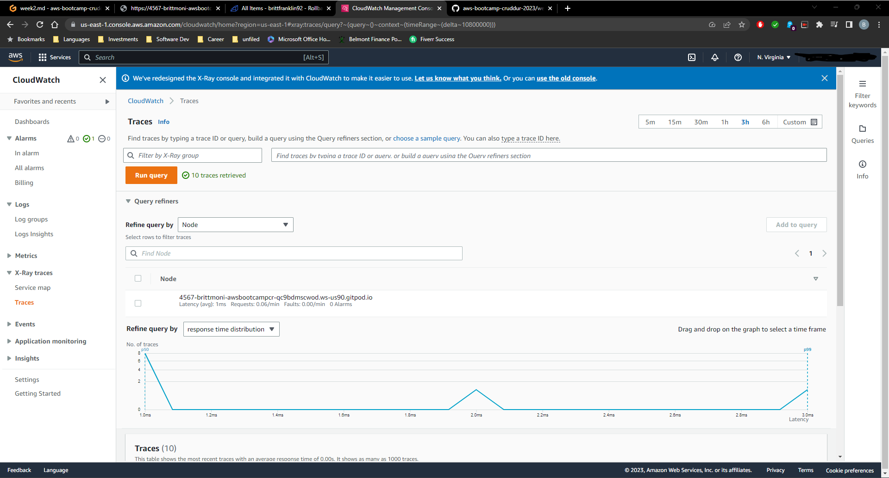
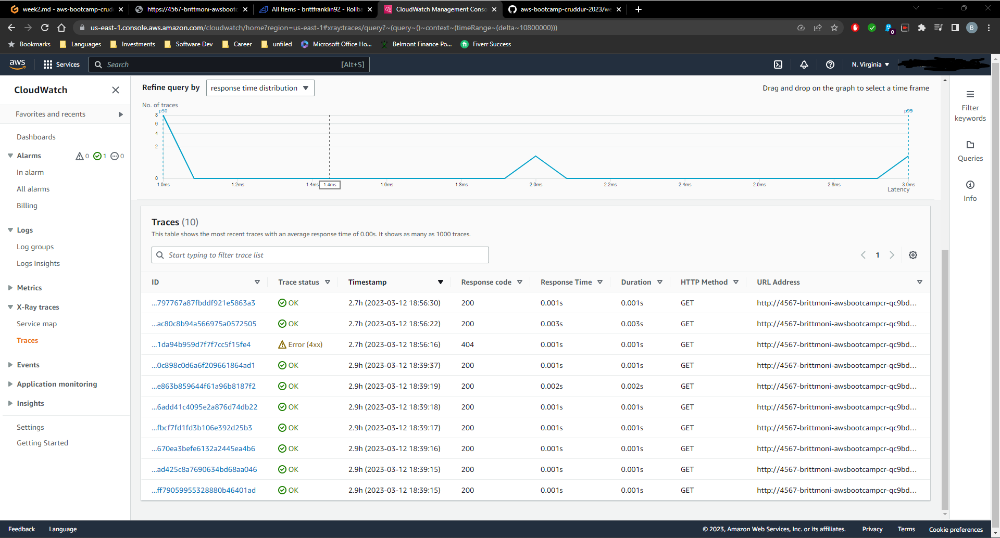

# Week 2 — Distributed Tracing

For this week's homework, I updated the app.py file in the backend-flask directory with the instructions in order to utilize Honeycomb for observability of the Cruddur back-end. This was done by reviewing the Honeycomb documentation. 

I also implemented Rollbar by utilizing the Rollbar documentation.

X-Ray through AWS was also implemented using the AWS X-Ray documentation.

