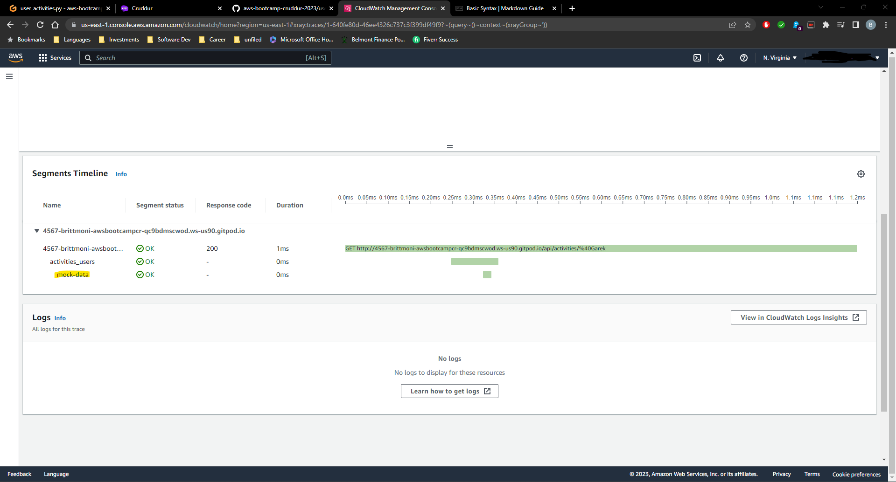
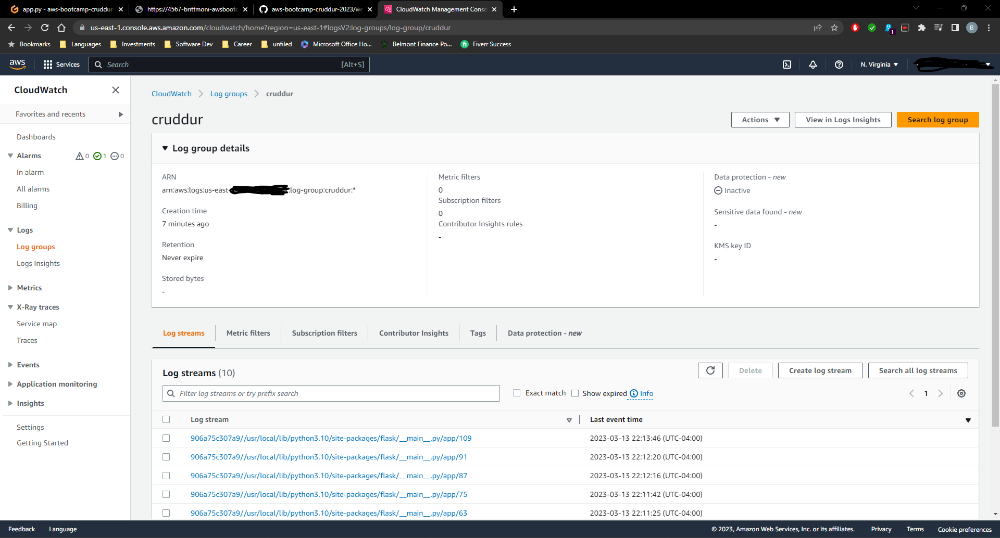
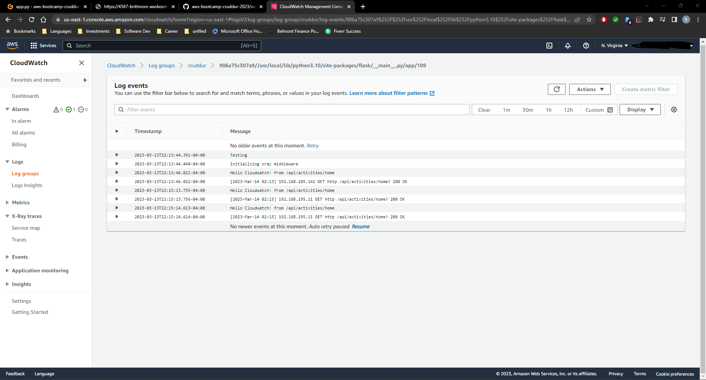

# Week 2 — Distributed Tracing

For this week's homework, I made several updates to app.py in order to implement Honeycomb, Rollbar, AWS X-Ray, and AWS Cloudwatch. These tools will help with observing the application in order to alert to any errors or issues when attempting to access the Cruddur application, specifically the backend. In order to implement these tools, I had to follow the documentation for each service in order to correctly integrate the tools in app.py in the backend-flask directory.

There were also changes made to home_activities.py in the backend-flask directory. Lines 8 and 9 were added to log data to CloudWatch when the Home page is hit. 

In user_activities.py, X-Ray subsegmentation was implemented. Lines 26 to 37 were added to implement the subsegmentation of X-Ray and the existing code was wrapped with a try statement (line 5).

As stated above, app.py is where the majority of the changes were implemented along with the docker-compose.yml file. Rollbar, Honeycomb, CloudWatch, and X-Ray were imported in app.py on the following lines: 5-9 (Rollbar), 22-29 (Honeycomb), 31-33 (X-Ray), and 35-38 (CloudWatch). After importation, I then had to set up the different applications within the code so that the data could be sent to the respective services. The set up occurs on the following lines: 40-47 and 102-107 (CloudWatch), 50-61 (Honeycomb), 79-82 (X-Ray), 84-100 and 108-111 (Rollbar). After this code was set up, the user activities and home routes were updated in order to test to ensure the observability tools were functioning as intended.

Finally, the docker-compose.yml file also had to be updated in order for the observability tools to utilize the proper environment variables.

**Honeycomb**

**Rollbar**

**AWS X-Ray**

**AWS CloudWatch**

