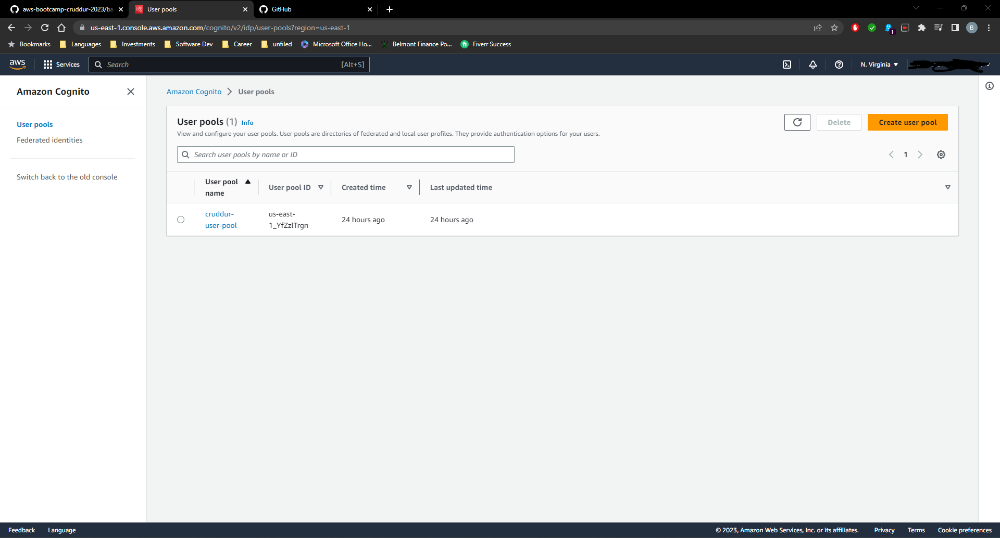
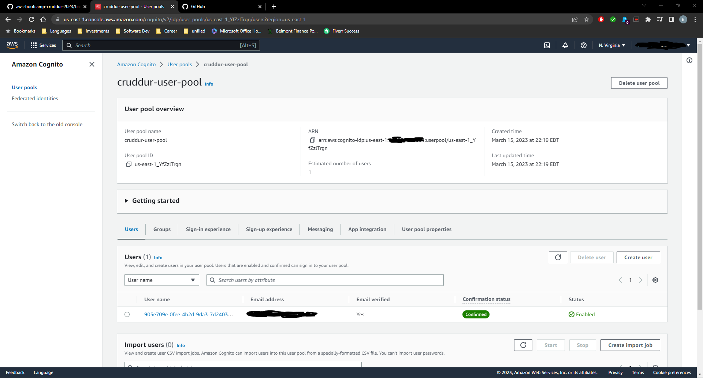
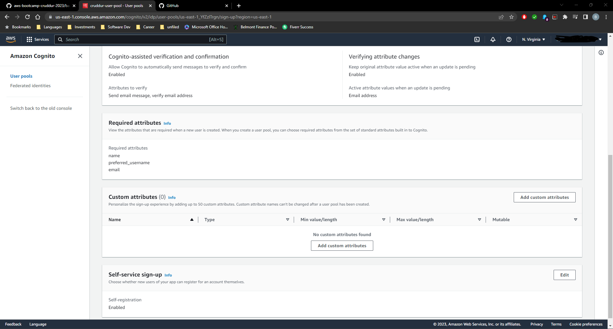
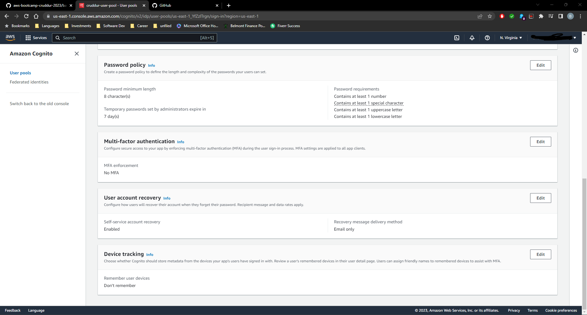
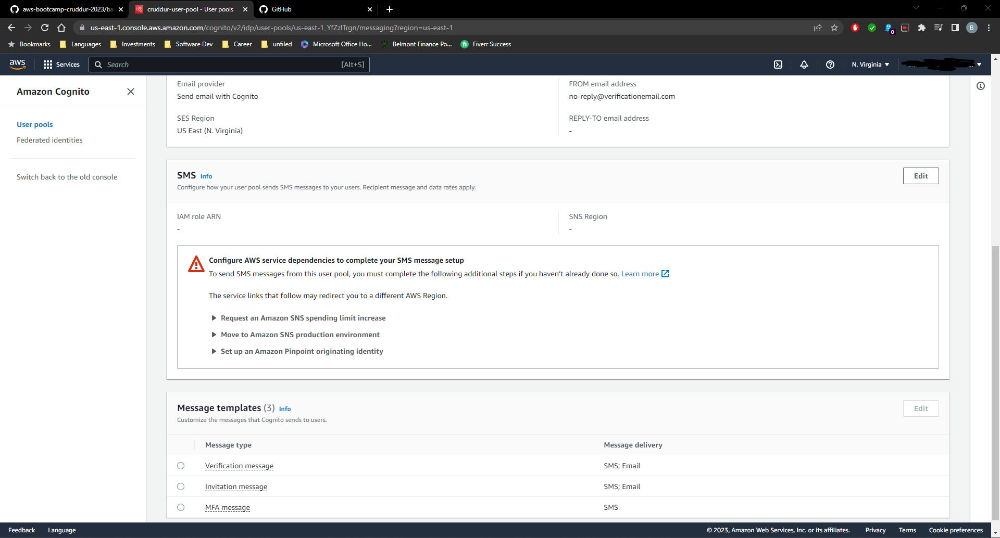
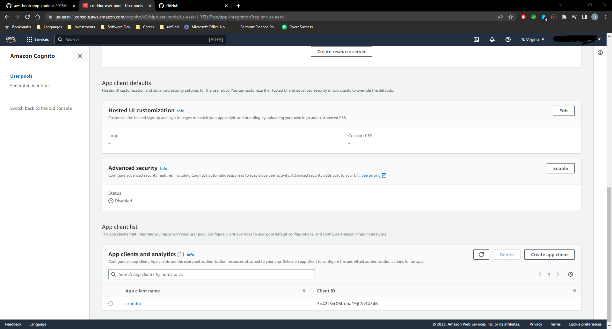

# Week 3 — Decentralized Authentication

This week I utilized AWS Cognito in order to allow users to sign up for and sign into Cruddur. I created the Cognito user pool via the AWS Console. After creating the AWS Cognito, I think hooked it up to the Cruddur app through app.py. I also configured the SignIn, SignUp, Confirmation, and Recovery pages based on the user authentication. The authentication persists across the DesktopNavigation and DesktopSidebar components. All of these changes allow the user to sign in to Cruddur, create a new Cruddur account, and reset the password. All of the user authentication is stored in AWS Cognito.

